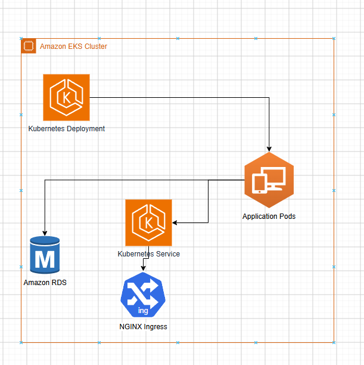

# Cloud Native CI/CD Pipeline on AWS EKS

---
## Table of Contents

- [Overview](#overview)
- [Project Architecture](#project-architecture)
- [CI/CD Workflow](#cicd-workflow)
- [Technology Stack](#technology-stack)
- [Infrastructure Provisioning](#infrastructure-provisioning)
- [Jenkins Pipeline](#jenkins-pipeline)
- [Trivy Security Scan](#trivy-security-scan)
- [Kubernetes Deployment](#kubernetes-deployment)
- [Project Outcome](#project-outcome)
- [Project Metrics](#project-metrics)
- [Future Improvements](#future-improvements)
- [Skills Demonstrated](#skills-demonstrated)
# Overview

This project demonstrates an end-to-end cloud-native DevOps workflow on AWS. The infrastructure is provisioned using Terraform, container images are built with Docker, security scanning is performed using Trivy, and the application is deployed to Amazon EKS through a Jenkins CI/CD pipeline.

The project follows Infrastructure as Code (IaC) principles and automates the complete deployment lifecycle, from code commit to Kubernetes deployment.

---
# Key Features

- Provision AWS infrastructure using Terraform.
- Automate CI/CD using Jenkins.
- Build and package applications with Docker.
- Scan container images using Trivy.
- Store images in Amazon ECR.
- Deploy applications to Amazon EKS.
- Verify Kubernetes rollout after deployment.
# Project Architecture

# CI/CD Workflow

# Technology Stack

| Category | Technology |
|------------|------------|
| Cloud | AWS |
| Infrastructure as Code | Terraform |
| Container | Docker |
| CI/CD | Jenkins |
| Registry | Amazon ECR |
| Container Orchestration | Amazon EKS |
| Security | Trivy |
| Networking | NGINX Ingress |
| Database | Amazon RDS |
| Operating System | Ubuntu Linux |

---

# Infrastructure Provisioning

Terraform provisions the following AWS resources:

- VPC
- Public Subnets
- Private Subnets
- Internet Gateway
- Route Tables
- Security Groups
- IAM Roles
- Amazon EKS
- Amazon ECR
- Amazon RDS
- EC2 (Jenkins Server)

---

# Jenkins Pipeline

The CI/CD pipeline consists of the following stages.

| Stage | Description |
|--------|-------------|
| Build | Build Docker Image |
| Scan | Scan Image using Trivy |
| Push | Push Image to Amazon ECR |
| Deploy | Deploy Application to Amazon EKS |
| Verify | Verify Kubernetes Rollout |
| Cleanup | Remove Local Docker Image |

---

# Trivy Security Scan

Trivy is integrated into the Jenkins Pipeline to improve deployment security.

Features

- Scan Docker Images
- Detect HIGH vulnerabilities
- Detect CRITICAL vulnerabilities
- Prevent deployment if critical vulnerabilities are detected

---

# Kubernetes Deployment

The application is deployed to Amazon EKS using Kubernetes manifests.

Resources

- Namespace
- Secret
- Deployment
- Service
- Ingress

Deployment Strategy

- Rolling Update
- Rollout Verification

Health Checks

- Readiness Probe
- Liveness Probe

---

# Project Outcome
- Provisioned AWS infrastructure using Terraform.
- Built a secure CI/CD pipeline using Jenkins.
- Integrated Trivy image vulnerability scanning.
- Automated container deployment to Amazon EKS.
- Implemented Kubernetes rollout verification.
- Published Infrastructure as Code (IaC) and deployment workflow on GitHub.

---

# Project Metrics

| Metric | Value |
|---------|------:|
| AWS Resources Provisioned | 10+ |
| Jenkins Pipeline Stages | 6 |
| Kubernetes Resources | 5 |
| Container Registry | Amazon ECR |
| Security Scanner | Trivy |
| Deployment Platform | Amazon EKS |

---
# Future Improvements

- GitOps with ArgoCD
- Helm Chart
- Prometheus Monitoring
- Grafana Dashboard
- Horizontal Pod Autoscaler (HPA)
- SonarQube Integration
- Slack / Telegram Notification

---
# Skills Demonstrated

- Infrastructure as Code (Terraform)
- AWS Cloud (EKS, ECR, EC2, RDS)
- Docker Containerization
- Jenkins CI/CD
- Kubernetes Deployment
- Trivy Container Security
- Git & GitHub
- Linux Administration
